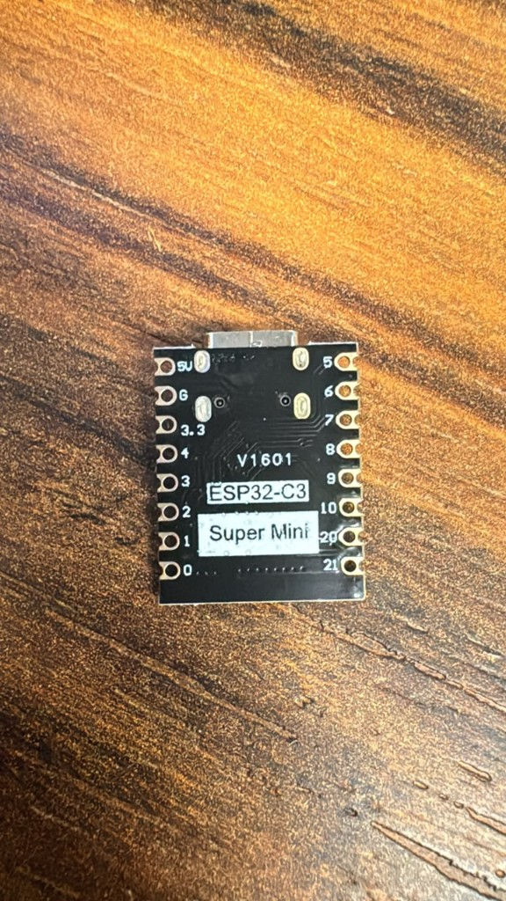
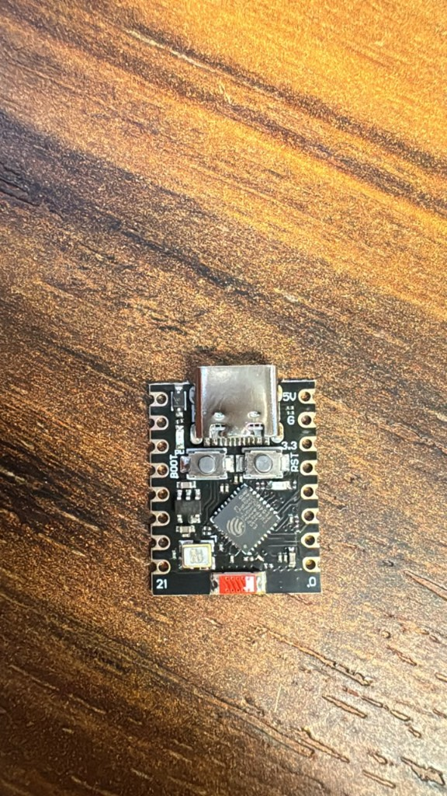

# DFLTech ESPHome Wall Switch

ESPHome firmware for an **ESP32-C3 Super Mini** that reads 6 GND inputs from a custom wall switch and sends click events to Home Assistant (single, double, and hold).

Distributed as a **product firmware**: flash once, provision Wi-Fi via captive portal, receive OTA updates through Home Assistant.

## Hardware

Board: **ESP32-C3 Super Mini** (`esp32-c3-devkitm-1`). Each input is active-low (switch connects to GND). Internal pull-ups are enabled in firmware.

<p align="center">
  
  &nbsp;
  
</p>

| Key / function | GPIO | Notes |
|----------------|------|-------|
| 1 | GPIO0 | |
| 2 | GPIO1 | |
| 3 | GPIO3 | |
| 4 | GPIO4 | |
| 5 | GPIO5 | |
| 6 | GPIO6 | |
| Factory reset | GPIO9 | BOOT button on the Super Mini |
| (unused) | GPIO8 | Onboard LED / strapping — do not use for keys |
| (avoid) | GPIO2 | Strapping pin — do not hold LOW at boot |

### Power

- **USB-C**: programming and power while developing.
- **5V pin**: for standalone/wall install — connect regulated **5V** to `5V` and ground to `G`. The onboard regulator provides 3.3V to the chip.
- Do **not** power from USB-C and the 5V pin at the same time.
- Do **not** apply 5V to any GPIO (3.3V logic only). Switches go to GND.

## End users

### Install firmware (first time)

1. Download the latest `*.factory.bin` from [GitHub Releases](https://github.com/dflourusso/ha-esphome-switch/releases), **or** use the browser installer at [dflourusso.github.io/ha-esphome-switch](https://dflourusso.github.io/ha-esphome-switch/) (Chrome/Edge, USB-C connected).
2. If the browser flasher cannot connect, hold **BOOT**, tap **RST**, then release **BOOT**, and try again.
3. After flashing, the device creates a Wi-Fi access point named `dfltech-switch-XXXXXX` (password: `dfltech-setup`).
4. Connect with your phone — the captive portal opens (or open http://192.168.4.1/).
5. Enter your home Wi-Fi credentials.
6. In Home Assistant, add the device via **Settings → Devices & services → ESPHome** (`dfltech-switch-XXXXXX.local`).

### OTA updates

When a new version is published, Home Assistant shows a **Firmware** update on the device. Install from the device page or **Settings → Updates**.

### Factory reset

Hold the **BOOT** button (GPIO9) on the Super Mini for **10 seconds**, then release. Wi-Fi credentials are cleared and the setup access point starts again.

### Device naming

Each device gets a unique hostname (`dfltech-switch-aabbcc`) from its MAC address. After adding to Home Assistant, rename the device in the ESPHome integration UI if you want a friendlier label (e.g. "Kitchen Switch").

## Developers

### Project layout

```
ha-esphome-switch/
├── dfltech-switch.yaml          # Core device logic (keys, captive portal, factory reset)
├── key.yaml                     # Shared single/double/hold key package
├── dfltech-switch.factory.yaml  # Distribution build (HTTP OTA + update entity)
├── dfltech-switch.dev.yaml      # Local dev overlay (Wi-Fi from secrets)
├── secrets.template.yaml        # Template for local secrets.yaml
├── docs/images/                 # Board photos (ESP32-C3 Super Mini)
├── static/                      # GitHub Pages installer site
└── .github/workflows/           # CI, release, and Pages deploy
```

### Local compile

**Factory image (what you ship):**

```bash
docker run --rm -v "$PWD:/config" ghcr.io/esphome/esphome compile dfltech-switch.factory.yaml
```

Output: `.esphome/build/dfltech-switch/.pioenvs/dfltech-switch/firmware.bin` (or use the `*.factory.bin` from CI).

**Dev build (your Wi-Fi credentials):**

```bash
cp secrets.template.yaml secrets.yaml
# edit secrets.yaml
docker run --rm -v "$PWD:/config" ghcr.io/esphome/esphome compile dfltech-switch.dev.yaml
```

Or with ESPHome installed locally: `esphome compile dfltech-switch.factory.yaml`

### Publish a release

1. Go to **Actions → Release Firmware → Run workflow**.
2. Enter a version (e.g. `2.0.0`) and optional release notes.
3. The workflow builds firmware, creates a GitHub Release with `.factory.bin` / `.ota.bin`, and deploys GitHub Pages with the OTA manifest.

OTA manifest URL (devices poll this): `https://dflourusso.github.io/ha-esphome-switch/firmware/manifest.json`

### Flashing on macOS

Docker cannot pass USB serial reliably on macOS. Compile in Docker, then flash via:

- [ESPHome Web](https://web.esphome.io) — upload `firmware.bin` over USB-C
- Browser installer on the GitHub Pages site (Chrome/Edge)
- If needed: hold **BOOT**, tap **RST**, release **BOOT**, then flash

## Home Assistant integration

Button actions are sent as events:

| Event type | `esphome.dfltech_switch` |
|------------|--------------------------|
| `key` | `"1"` … `"6"` |
| `action` | `single`, `double`, `hold` |

Hold requires the button to be pressed for at least **1.2 seconds**.

Example automation:

```yaml
automation:
  - alias: "Wall switch key 1 single"
    trigger:
      - platform: event
        event_type: esphome.dfltech_switch
        event_data:
          key: "1"
          action: single
    action:
      - service: light.toggle
        target:
          entity_id: light.living_room
```

## Troubleshooting

**Device won't join Wi-Fi** — Use factory reset (BOOT 10s), then re-provision via captive portal.

**Flasher cannot open the port** — Use a data-capable USB-C cable. Hold BOOT, tap RST, release BOOT, then retry.

**OTA check fails** — Ensure GitHub Pages is deployed after a release and the device can reach the internet.
