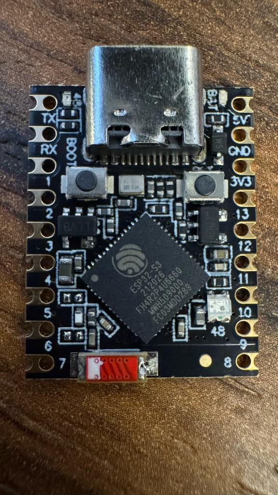
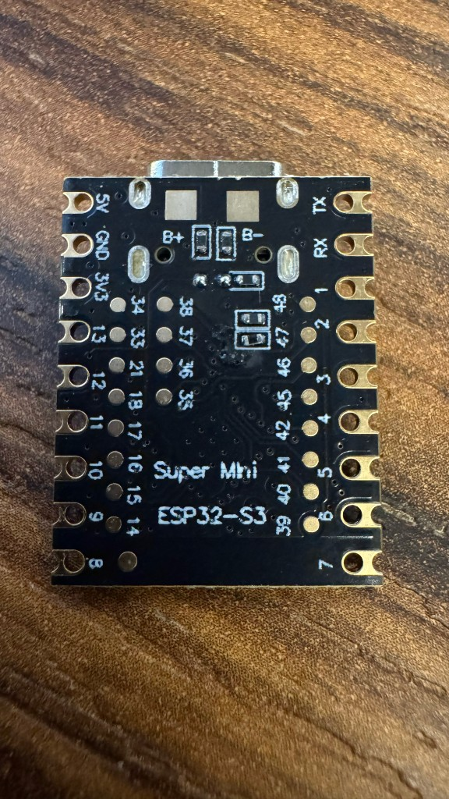

# DFLTech ESPHome Wall Switch

ESPHome firmware for an **ESP32-S3 Super Mini** that reads 6 GND inputs from a custom wall switch and sends click events to Home Assistant. Each key can be set to **Click** (single / double / hold) or **Dim** (single + dim up/down while held) from the device page.

The same module also runs as a **BLE Proxy** (`bluetooth_proxy`): it forwards BLE advertisements and GATT to Home Assistant so one board per room covers both the wall switch and room BLE (Private BLE Device, Bermuda, BTHome, and similar).

Distributed as a **product firmware**: flash once, provision Wi-Fi via captive portal, receive OTA updates through Home Assistant.

## Hardware

Board: **ESP32-S3 Super Mini** (`esp32-s3-devkitc-1`, 4MB flash). Each input is active-low (switch connects to GND). Internal pull-ups are enabled in firmware. Keys use only the **side edge pins with holes** (power-side bank).

<p align="center">
  
  &nbsp;
  
</p>

| Key / function | GPIO | Notes |
|----------------|------|-------|
| 1 | GPIO13 | Power-side edge (USB → bottom) |
| 2 | GPIO12 | |
| 3 | GPIO11 | |
| 4 | GPIO10 | |
| 5 | GPIO9 | |
| 6 | GPIO8 | |
| Factory reset | GPIO0 | BOOT button on the Super Mini |
| (avoid) | GPIO3 | Strapping pin — do not hold LOW at boot |
| (unused for keys) | TX / RX | UART0 (GPIO43 / GPIO44) |
| (unused) | Inner pads | Use side holes only |

### Power

- **USB-C**: programming and power while developing.
- **5V pin**: for standalone/wall install — connect regulated **5V** to `5V` and ground to `GND`. The onboard regulator provides 3.3V to the chip.
- Do **not** power from USB-C and the 5V pin at the same time.
- Do **not** apply 5V to any GPIO (3.3V logic only). Switches go to GND.

### BLE Proxy

Scanning starts after Home Assistant connects and stops when HA disconnects (`esp32_ble_tracker` + `bluetooth_proxy` with `active: true`, `connection_slots: 3`).

For iPhone Private BLE / IRK capture, use a spare board with the IRK Capture firmware in [ha-esphome-ble-scanner](https://github.com/dflourusso/ha-esphome-ble-scanner) — do not combine IRK Capture with this image (BLE stack conflict).

## End users

### Install firmware (first time)

1. Download the latest `*.factory.bin` from [GitHub Releases](https://github.com/dflourusso/ha-esphome-switch/releases), **or** use the browser installer at [dflourusso.github.io/ha-esphome-switch](https://dflourusso.github.io/ha-esphome-switch/) (Chrome/Edge, USB-C connected).
2. If the browser flasher cannot connect, hold **BOOT**, tap **RST**, then release **BOOT**, and try again.
3. After flashing, prefer **Configure Wi-Fi** in the installer dialog (USB still connected). SoftAP fallback: join `dfltech-switch-XXXXXX` (password `dfltech-setup`) and open http://192.168.4.1/.
4. Enter your home Wi-Fi credentials.
5. In Home Assistant, add the device via **Settings → Devices & services → ESPHome** (`dfltech-switch-XXXXXX.local`).

### OTA updates

When a new version is published, Home Assistant shows a **Firmware** update on the device. Install from the device page or **Settings → Updates**.

### Factory reset

Hold the **BOOT** button (GPIO0) on the Super Mini for **10 seconds**, then release. Wi-Fi credentials are cleared and the setup access point starts again.

### Device naming

Each device gets a unique hostname (`dfltech-switch-aabbcc`) from its MAC address. After adding to Home Assistant, rename the device in the ESPHome integration UI if you want a friendlier label (e.g. "Kitchen Switch").

## Developers

### Project layout

```
ha-esphome-switch/
├── dfltech-switch.yaml          # Core device logic (keys, BLE proxy, captive portal, factory reset)
├── key.yaml                     # Shared key package (Click / Dim modes)
├── dfltech-switch.factory.yaml  # Distribution build (HTTP OTA + update entity)
├── dfltech-switch.dev.yaml      # Local dev overlay (Wi-Fi from secrets)
├── secrets.template.yaml        # Template for local secrets.yaml
├── docs/images/                 # Board photos (ESP32-S3 Super Mini)
├── static/                      # GitHub Pages installer site
└── .github/workflows/           # CI, release, and Pages deploy
```

### Local compile

**Factory image (what you ship):**

```bash
docker run --rm -v "$PWD:/config" ghcr.io/esphome/esphome compile dfltech-switch.factory.yaml
```

Output: `.esphome/build/dfltech-switch/.pioenvs/dfltech-switch/firmware.bin` (or use the `*.factory.bin` from CI).

**Dev build (your Wi-Fi credentials):**

```bash
cp secrets.template.yaml secrets.yaml
# edit secrets.yaml
docker run --rm -v "$PWD:/config" ghcr.io/esphome/esphome compile dfltech-switch.dev.yaml
```

Or with ESPHome installed locally: `esphome compile dfltech-switch.factory.yaml`

### Publish a release

Do **not** bump `esphome.project.version` in YAML. Factory builds keep `version: dev`; the release workflow replaces that with the version you type in.

1. Go to **Actions → Release Firmware → Run workflow**.
2. Enter a version (e.g. `2.3.0`) and optional release notes.
3. The workflow writes that version into the factory YAML, builds firmware, creates a GitHub Release with `.factory.bin` / `.ota.bin`, and deploys GitHub Pages with the OTA manifest (root `version` matches the release).

OTA manifest URL (devices poll this): `https://dflourusso.github.io/ha-esphome-switch/firmware/manifest.json`

### Flashing on macOS

Docker cannot pass USB serial reliably on macOS. Compile in Docker, then flash via:

- [ESPHome Web](https://web.esphome.io) — upload `firmware.bin` over USB-C
- Browser installer on the GitHub Pages site (Chrome/Edge)
- Prefer **Configure Wi-Fi** in the installer after flash (Improv over USB)
- SoftAP fallback: hold **BOOT**, tap **RST**, release **BOOT**, then flash if needed; join `dfltech-switch-XXXXXX` / `dfltech-setup`

## Home Assistant integration

Each key appears as an **event entity** on the device (`Key 1` … `Key 6`). Use these for automations — especially when you have multiple switches, since Home Assistant scopes them to the correct device automatically.

### Key mode (device page)

Each key also has a **Key N Mode** select under the device **Configuration** section. The choice is stored on the device flash and survives reboots.

| Mode | Behavior |
|------|----------|
| **Click** (default) | `single`, `double`, `hold` |
| **Dim** | Short press → `single`. Press-and-hold (~400ms) → `dim_up` or `dim_down` (alternates each hold), then `release` when you let go. No double-click. |

**Click timing:** short presses must be ≤ **300ms**; after release, wait **300ms** before `single` (so double-click can be detected). **Hold** requires at least **1.2 seconds**.

**Dim timing:** hold past **~400ms** starts dimming; release before that is a `single`.

### Recommended: Event received or Device trigger

Do **not** use a State trigger with Attribute → Event type → To `single`. That only fires when the type *changes* (e.g. `double` → `single`). A second single press leaves the attribute at `single`, so the automation will not run again. Event entities never clear back to null; the state value is a timestamp that updates on every press.

**UI options that work for repeated presses:**

1. **Event received** → pick `Key 1` → Event type `single`
2. **Device** → your switch → **Key 1** → Single
3. **State** on `Key 1` with **no** Attribute / To filter, then an **And if** condition: Attribute `Event type` is `single`

**YAML — state + condition** (fires every single press):

```yaml
automation:
  - alias: "Kitchen switch key 1 single"
    trigger:
      - platform: state
        entity_id: event.dfltech_switch_xxxx_key_1
    condition:
      - condition: state
        entity_id: event.dfltech_switch_xxxx_key_1
        attribute: event_type
        state: single
    action:
      - service: light.toggle
        target:
          entity_id: light.kitchen
```

**YAML — device trigger:**

```yaml
automation:
  - alias: "Kitchen switch key 1 single"
    trigger:
      - platform: device
        domain: event
        device_id: YOUR_DEVICE_ID
        entity_id: event.dfltech_switch_xxxx_key_1
        type: single
    action:
      - service: light.toggle
        target:
          entity_id: light.kitchen
```

The entity id includes the MAC suffix (e.g. `event.dfltech_switch_9cc001d18b48_key_1`). Creating the automation from the device page or **Event received** fills in the ids for you.

### Dim mode blueprint (toggle + hold-to-dim)

Set **Key N Mode** to **Dim** on the device page, then use the blueprint shipped with [home-automation](https://github.com/dflourusso/home-automation) (bind-mounted into HA):

[`homeassistant/blueprints/automation/dfltech-switch-dim-key.yaml`](https://github.com/dflourusso/home-automation/blob/main/homeassistant/blueprints/automation/dfltech-switch-dim-key.yaml)

After `git pull` on the home-automation host, recreate HA so the bind mount picks it up. In HA: **Settings → Automations & scenes → Blueprints** → **DFLTech Switch — Dim key** → create automation → pick **Key** + **Light**.

Behavior: short press toggles; hold dims up/down (direction alternates on the device); release stops.

### Legacy: event bus (all devices share one event type)

Button actions are also sent as a global event (backward compatible, but not scoped to a device):

| Event type | `esphome.dfltech_switch` |
|------------|--------------------------|
| `key` | `"1"` … `"6"` |
| `action` | `single`, `double`, `hold`, `dim_up`, `dim_down`, `release` |

Use this only for automations that should fire from **any** switch. For per-room rules with multiple devices, prefer the event entities above.

```yaml
automation:
  - alias: "Any switch key 6 hold"
    trigger:
      - platform: event
        event_type: esphome.dfltech_switch
        event_data:
          key: "6"
          action: hold
    action:
      - service: light.turn_off
        target:
          area_id: living_room
```

## Troubleshooting

**Device won't join Wi-Fi** — Prefer USB **Configure Wi-Fi** after flash. SoftAP fallback: factory reset (BOOT 10s), then re-provision.

**Board runs warm** — Super Mini boards run warm under Wi-Fi + BLE. SoftAP is hotter than STA. After joining home Wi-Fi (with LIGHT power save), it should settle cooler. Stop if too hot to touch.

**Flasher cannot open the port** — Use a data-capable USB-C cable. Hold BOOT, tap RST, release BOOT, then retry.

**Private BLE says no adapter** — Confirm this device is online in ESPHome (it exposes `bluetooth_proxy`). BLE scan starts only after HA is connected.

**OTA check fails** — Ensure GitHub Pages is deployed after a release and the device can reach the internet.
